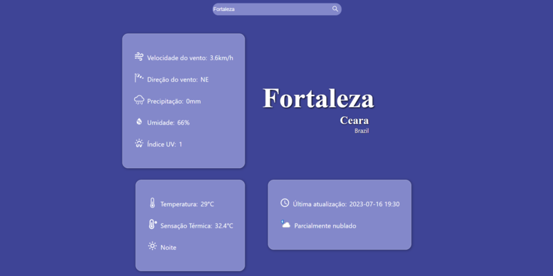
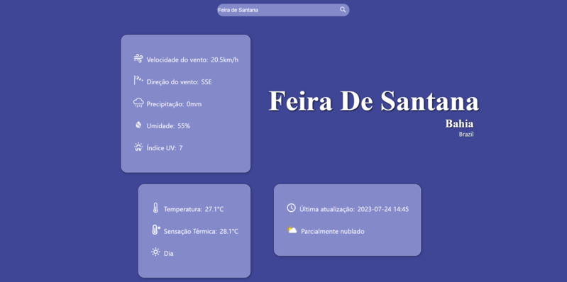

# Weather

### Um site que permite ao usuário pesquisar por uma cidade e visualizar as principais informações meteorológicas atuais a respeito dessa cidade.

### O frontend foi feito utilizando React e utilizado as informações meteorológicas da API WeatherAPI (https://www.weatherapi.com/) que retorna as informações em fortato json. Foi utilizado a função Fetch para consumir a citada API e variáveis de ambiente (.ENV) para manter a API_KEY secreta.

 

 
